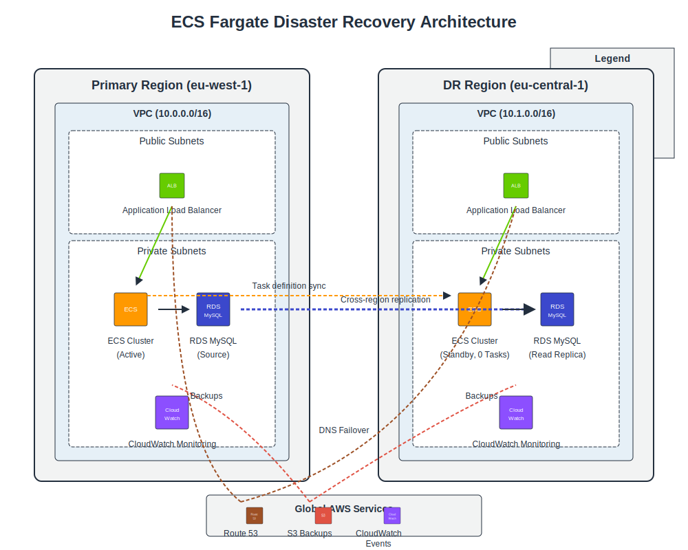

# AWS ECS Fargate Infrastructure as Code

This repository contains Terraform modules and supporting scripts for deploying and managing a production-ready ECS Fargate infrastructure with disaster recovery (DR) capabilities.

## Documentation Structure

This project's documentation is organized as follows:

- **[Main README](README.md)** - Overview and getting started (this file)
- **[DR Architecture](docs/dr.md)** - Detailed disaster recovery architecture and procedures
- **[Backup & Monitoring](docs/backup-monitoring.md)** - Backup and monitoring solutions
- **[DR Implementation Plan](docs/dr-implementation-plan.md)** - Phased implementation roadmap
- **[Scripts Documentation](docs/scripts.md)** - Detailed guide to all utility scripts

## Architecture Diagram



## Architecture Overview

This infrastructure implements:

- **Multi-region deployment** with primary and DR regions
- **ECS Fargate** for containerized applications with cost optimization
- **RDS MySQL** database in private subnets with cross-region read replica
- **AWS Secrets Manager** for secure credential management
- **Application Load Balancer** for request distribution
- **CloudWatch monitoring** with critical alarms
- **Regular backups** of task definitions and RDS snapshots

## Directory Structure

```
.
├── docs/                       # Detailed documentation
├── scripts/                    # Utility scripts
│   ├── dr-activate.sh          # DR activation script
│   ├── dr-deactivate.sh        # DR deactivation script
│   ├── backup-task-definitions.sh  # ECS task definition backup
│   └── manage-rds-snapshots.sh # RDS snapshot management
├── terraform/
│   ├── environments/           # Environment-specific configurations
│   │   ├── dev/                # Development environment
│   │   └── prod/               # Production environment
│   └── modules/                # Reusable Terraform modules
│       ├── dr/                 # DR infrastructure module
│       ├── ecs/                # ECS Fargate service and task definitions
│       ├── rds/                # RDS MySQL database
│       ├── monitoring/         # CloudWatch monitoring resources
│       ├── secrets/            # AWS Secrets Manager resources
│       └── vpc/                # VPC networking resources
```

## Getting Started

### Prerequisites

- AWS CLI configured with appropriate credentials
- Terraform v1.0.0+
- jq (for task definition scripts)
- MySQL client tools (for database operations)

### Initial Setup

1. Clone this repository
2. Configure AWS CLI credentials for both primary and DR regions
3. Navigate to the environment directory you want to deploy

```bash
cd terraform/environments/dev
```

4. Initialize Terraform and deploy

```bash
terraform init
terraform plan
terraform apply
```

## Core Features

### 1. Disaster Recovery

This infrastructure uses a module-based DR approach with:

- **Cross-region replication** of MySQL 8.0 database
- **Standby environment** in secondary AWS region (eu-central-1)
- **Pilot Light** to minimize costs during normal operations
- **Automated task definition synchronization** between regions

[Learn more about DR architecture and procedures](docs/dr.md)

### 2. Backup & Monitoring

The infrastructure includes comprehensive backup and monitoring:

- **CloudWatch dashboards** for both primary and DR regions
- **Critical alarms** for replication lag, ECS health, and RDS metrics
- **Regular backups** of task definitions and RDS snapshots
- **SNS notifications** for alert delivery

[Learn more about backup & monitoring](docs/backup-monitoring.md)

### 3. DR Scripts

Key scripts for DR operations include:

- **dr-activate.sh** - Activates DR environment during failover
- **dr-deactivate.sh** - Deactivates DR during failback and recreates read replica
- **backup-task-definitions.sh** - Backs up ECS task definitions from both regions
- **manage-rds-snapshots.sh** - Creates and manages cross-region RDS snapshots

[Learn more about all scripts](docs/scripts.md)

## DR Activation Quick Reference

```bash
# Set environment variables
export SOURCE_REGION=eu-west-1
export DR_REGION=eu-central-1
export ENVIRONMENT=dev
export APP_NAME=bmdb
export DESIRED_COUNT=2
export PROMOTE_DB=true

# Run DR activation script
./scripts/dr-activate.sh
```

## DR Deactivation Quick Reference

```bash
# Set environment variables
export SOURCE_REGION=eu-west-1
export DR_REGION=eu-central-1
export ENVIRONMENT=dev
export APP_NAME=bmdb
export PRIMARY_DESIRED_COUNT=2
export SYNC_DATA=true
export RECREATE_REPLICA=true

# Run DR deactivation script
./scripts/dr-deactivate.sh
```

## Important Notes

- **RDS Read Replica Recreation**: After promoting a read replica to a standalone database, AWS RDS does not support converting it back to a read replica. The `dr-deactivate.sh` script includes logic to recreate the cross-region read replica using Terraform.

- **Regular Testing**: Regular testing of DR procedures is essential to ensure readiness.

## Next Steps

For the implementation roadmap and future enhancements, see the [DR Implementation Plan](docs/dr-implementation-plan.md).
